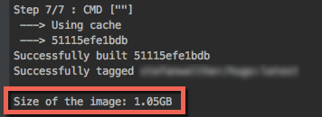

+++
title = "Building Docker Images - Check the Size"
description = "Getting the size of docker images after building it ..."
date = "2017-12-03"
linktitle = ""
featured = "header.png"
featuredpath = "~"
featuredalt = ""
author = "Stefan Walther"
type = "post"
slug = ""
images = ["https://stefanwalther.io/blog/docker-image-size/header.png"]
thumbnail = "header.png"
+++

When building Docker Images one can easily forget to optimize the size of the images.
Therefore I prefer to always get the immediate feedback, how large the resulting docker images is.

Here's a small, reusable script, I use in some of my projects, a reusable section in a Makefile.

```
DOCKER_IMAGE_NAME = <your-docker-image-name>
DOCKER_IMAGE_SIZE = $(shell docker images --format "{{.Repository}} {{.Size}}" | grep $(DOCKER_IMAGE_NAME) | cut -d\   -f2)

build:          ## Build the docker image
  docker build -t $(DOCKER_IMAGE_NAME) .
  @echo ''
  @echo "Size of the image: ${DOCKER_IMAGE_SIZE}"
  @echo ''
.PHONY: build

```

## Result

Running `make build` now gives me:



OK, very good, I immediately got the feedback that this image is really big, so I do not forget to focus immediately on some improvements.

## Summary

A nice and tiny helper to be added to the toolbox.